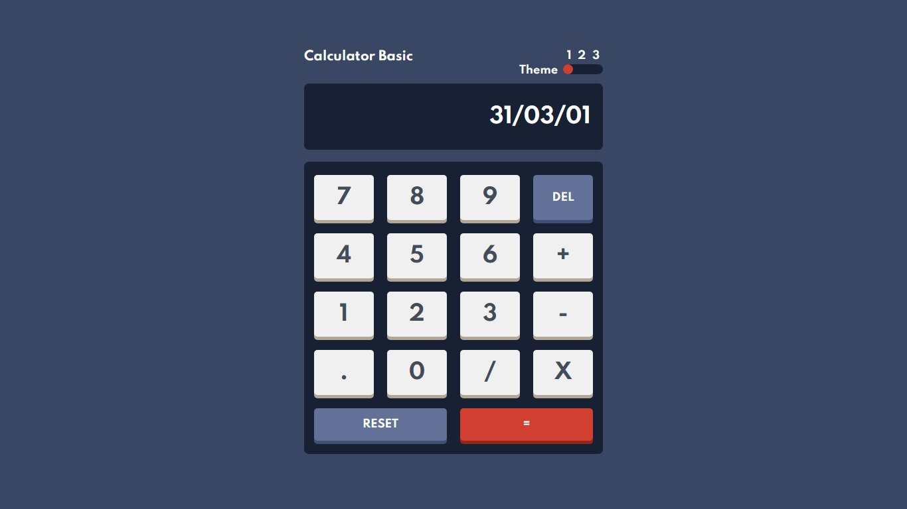

# CALCULATOR APP 🚀

## Description 📝:
- Project built with the basic tools of a website, the calculator is an improved version of previous calculator projects.
- URL: https://juanrcoder.github.io/Project-Calculator-App/
## improvements:
- Add different themes for the day🌞/night🌜.
- Sound effects to the buttons.🔊

## Languajes / Tools 📌:
- HTML
- CSS
- JavaScript
- VSCode

## Author:
- Juan Ramirez 😃
